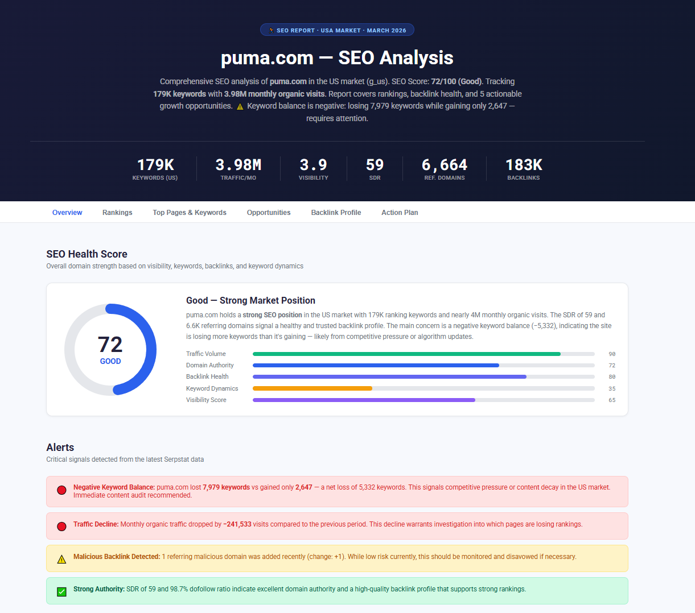
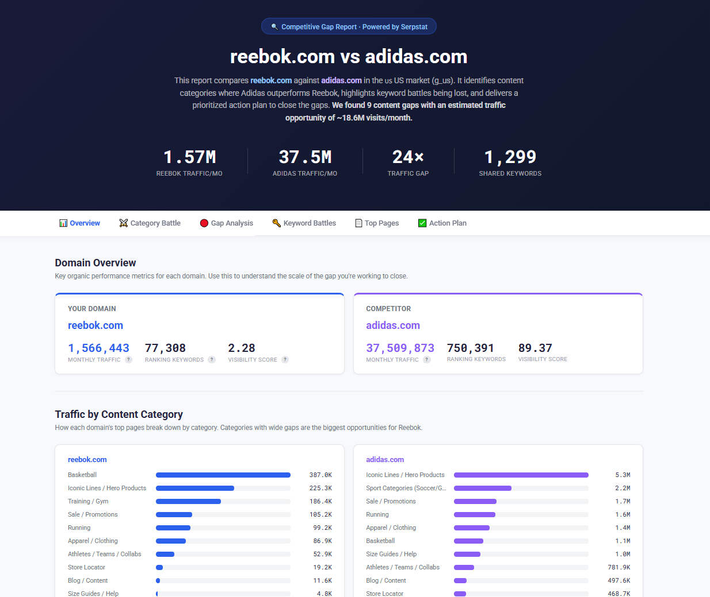
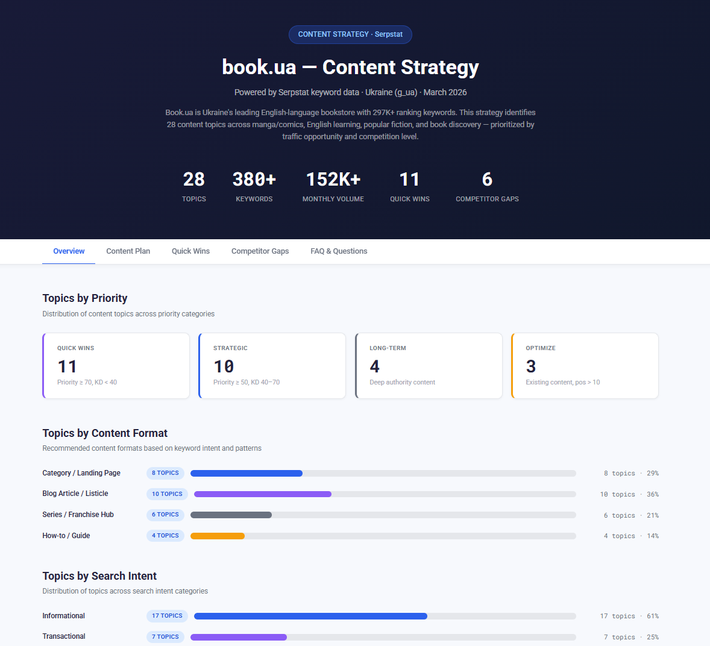
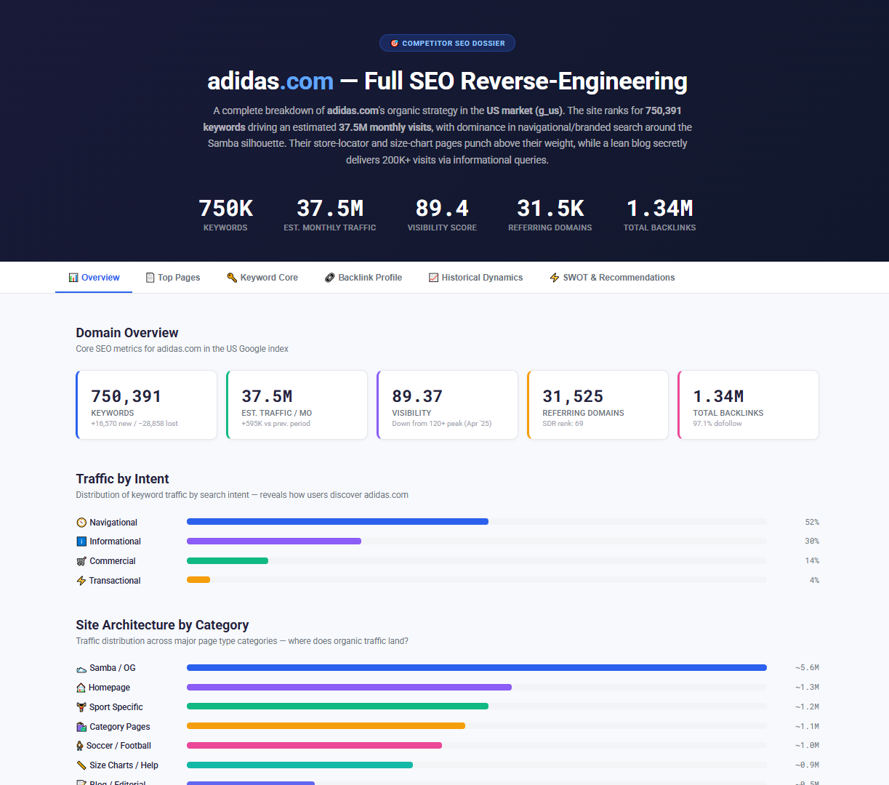
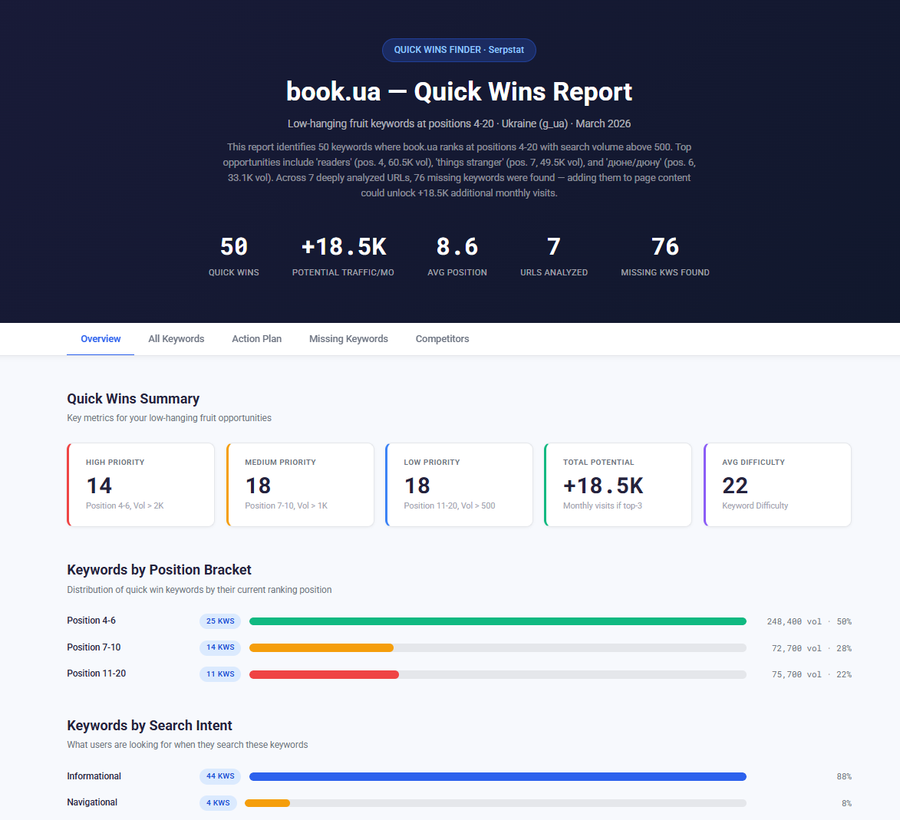

  

# Serpstat MCP Skills for Claude

A collection of ready-to-use **Skills for Claude** (claude.ai web) that turn Serpstat data into polished, interactive SEO dashboards — in about 2 minutes per analysis.

Each skill orchestrates a full multi-step workflow: it calls the Serpstat MCP connector, processes the data, and outputs a self-contained HTML report you can open in any browser.

---

## Skills Overview

| Skill | What it does |
|---|---|
| [SEO Report](#-seo-report) | Full SEO health dashboard — rankings, backlinks, opportunities, action plan |
| [Competitive Gap](#-competitive-gap) | Content gap analysis between your domain and 1–2 competitors |
| [Content Strategy](#-content-strategy) | Keyword clustering + prioritized 3–6 month content calendar |
| [Competitor Reverse-Engineer](#-competitor-reverse-engineer) | Deep dossier on a single competitor's SEO strategy |
| [Quick Wins](#-quick-wins) | Finds keywords at positions 4–20 with high traffic potential |

---

## Two Formats

**Ready to install** — download the `.skill` file and install it in one click via Claude Settings → Skills. No setup needed.

**Want to read or customize** — each skill also ships as a plain `SKILL.md` file in its folder. You can read exactly what Claude does step by step, fork and tweak the prompts, or use it as a reference when building your own skills.

---

## Prerequisites

All skills require the **Serpstat MCP connector** to be enabled in your Claude chat.

👉 [How to connect Serpstat MCP to Claude](https://api-docs.serpstat.com/docs/serpstat-mcp/hg4fnm7556jem-claude-http-version)

---

## How to Install a Skill

1. Download the `.skill` file for the skill you want (from this repo)
2. Open [claude.ai](https://claude.ai) and go to **Settings → Skills**
3. Click **Install from file** and select the downloaded `.skill` file
4. The skill is now available in your chats — just describe what you want and Claude will trigger it automatically

> Skills are triggered by natural language. You don't need to type a command — just say something like *"Run an SEO report for example.com"* or *"Find quick wins for my site example.com"*.

---

## Skills

### 📊 SEO Report

**File:** [`serpstat-seo-report.skill`](serpstat-seo-report.skill)

A comprehensive one-page SEO health dashboard for any domain. Covers organic visibility, keyword rankings, position distribution, keyword difficulty, top pages, backlink profile (SDR, dofollow/nofollow ratio, anchor analysis), opportunity finder, and a prioritized action plan — all in a single interactive HTML file.

**Output tabs:** Overview · Rankings · Top Pages & Keywords · Opportunities · Backlink Profile · Action Plan

**Trigger phrases:**
> "Run an SEO report for serpstat.com"
> "SEO audit of example.com in the US market"
> "How is moz.com doing in SEO?"
> "Give me a full SEO analysis of anotherdomain.com"

---

### 🔍 Competitive Gap

**File:** [`serpstat-competitive-gap.skill`](serpstat-competitive-gap.skill)

Compares your domain against 1–2 competitors by pulling top pages sorted by organic traffic, classifying URLs into content categories, identifying missing topics and underperforming areas, enriching gaps with keyword intersection data, and delivering a prioritized action plan with concrete to-do items.

**Output tabs:** Overview · Category Battle · Gap Analysis · Keyword Battles · Top Pages Explorer · Action Plan

**Trigger phrases:**
> "Compare puma.com with adidas.com and reebok.com"
> "Find content gaps between mybrand.com and competitor.com"
> "What content am I missing vs adidas?"
> "Run a competitive audit for my site"

---

### 📝 Content Strategy

**File:** [`serpstat-content-strategy.skill`](serpstat-content-strategy.skill)

Builds a complete content strategy by pulling current keyword rankings, expanding with related and long-tail keywords, finding competitor-only topics the domain misses, clustering everything by intent, and outputting a prioritized content plan with format recommendations (article, FAQ, category, landing page) across a 3–6 month timeline.

**Output tabs:** Overview · Content Plan · Quick Wins · Competitor Gaps · FAQ & Questions

**Trigger phrases:**
> "Build me a content plan for serpstat.com"
> "What should I write about on my blog? My site is mybrand.com"
> "Create a content strategy for example.com vs anotherdomain.com in the US market"
> "Give me blog topic ideas for example.com"

---

### 🕵️ Competitor Reverse-Engineer

**File:** [`serpstat-competitor-reverse-engineer.skill`](serpstat-competitor-reverse-engineer.skill)

Deep reverse-engineering of a single competitor's SEO strategy. Pulls 7 data types (metrics, top pages, keyword core, backlinks by page, anchor profile, backlink summary, 12-month history) and synthesizes them into a SWOT analysis with data-backed recommendations.

**Output tabs:** Overview · Top Pages · Keyword Core · Backlink Profile · Historical Dynamics · SWOT & Recommendations

**Trigger phrases:**
> "Reverse engineer anotherdomain.com's SEO strategy"
> "Do a competitor deep dive on example.com"
> "How is moz.com getting their traffic?"
> "Tell me everything about competitor.com's SEO"

---

### ⚡ Quick Wins

**File:** [`serpstat-quick-wins.skill`](serpstat-quick-wins.skill)

Finds keywords where the site already ranks at positions 4–20 with significant search volume — the easiest opportunities to push into top-3. For each URL, it identifies missing keywords to add to the content, benchmarks against top-3 competitors, and generates concrete micro-tasks (title tweaks, paragraph additions, internal links) with estimated traffic gain per task.

**Output tabs:** Overview · All Keywords · Action Plan · Missing Keywords by URL · Competitor Benchmarks

**Trigger phrases:**
> "Find quick wins for serpstat.com"
> "What keywords am I almost ranking for on example.com?"
> "Show me low-hanging fruit for mybrand.com in the US"
> "What's the fastest way to get more traffic to my site?"

---

## How Each Skill Works

All skills follow the same pattern:

1. **You provide a domain** (and optionally competitors and region)
2. **Claude auto-detects** missing parameters (region, competitors) and asks you to confirm before proceeding
3. **Serpstat API calls** are made via the MCP connector
4. **Claude analyzes** the data — classifies, scores, finds gaps
5. **An HTML dashboard** is generated and shared with you — fully self-contained, no server needed
6. **A text summary** highlights the top findings and next steps

> **Credit usage:** Each skill consumes approximately 400–960 Serpstat API credits. All skills check your credit balance before starting and stop if it's insufficient.

---

## License

MIT
